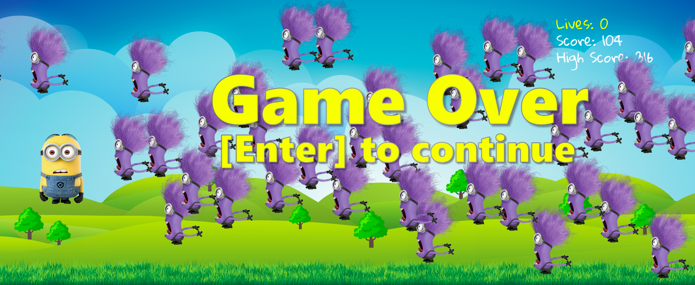

# Filet Minion
---

## About
Filet Minion is a 2D third person shooter game based on 
everyone's favorite creatures from the popular "Despicable Me"
film franchise.  Players take on the role of a good minion armed 
with a powerful (pineapple!) banana cannon and do their best to ward off
progressively more frantic onslaughts from hoards of evil minions.
Compete against your friends to see who can achieve the highest score
and lay claim to the title of being "One in a Minion!"  
<br>
<br>

<br>
<br>

<br>
<br>



## Project Members
This software was authored in equal parts by the following developers:
* <a href="https://github.com/mmonivis">Marissa Monivis</a>
* <a href="https://github.com/merileewheelock">Merilee Wheelock</a>
* <a href="https://github.com/chadm9">Chad McKee</a>

## Languages and Technologies 
* Python 2.7


## Dependencies and Plugins
* Pygame

## Code Example

The following code snippet demonstrates the handling of basic user inputs from the keyboard.


```Python
def checkEvents(good_minion, screen, bananas, tick, banana_sound, evils, minion_yahoo):
	for event in pygame.event.get():
	
	#If the user closes the game screen, terminate software execution.
		if event.type == pygame.QUIT:
			sys.exit()
	#If the player is alive and the user presses up (key 273), down 
	# (key 274), or space bar (key 32), move up, down, or fire a 
	# banana respectively. 
		elif event.type == pygame.KEYDOWN and good_minion.isAlive():
			if event.key == 273:
				good_minion.shouldMove("up", True)
			elif event.key == 274:
				good_minion.shouldMove("down", True)
			elif event.key == 32: 
				for direction in range(2, 3):
					new_banana  = Banana(screen, good_minion, direction)
					bananas.add(new_banana)
				banana_sound.play()
    	#If the user releases a motion key, stop player movement.
		elif event.type == pygame.KEYUP:
            		if event.key == 273:
                		good_minion.shouldMove("up", False)
            		elif event.key == 274:
                		good_minion.shouldMove("down", False)				
				
    	#If the player has died, start a new game if user presses enter (key 13).
		elif event.type == pygame.KEYDOWN and not good_minion.isAlive():
            		if event.key == 13:
                		good_minion.lives = 3
                		good_minion.score = 0
                		good_minion.opponent_frequency = 100
                		evils.empty()
                		minion_yahoo.play()
				#Exit the main game loop to restart game play.	
                		return False

 ```


